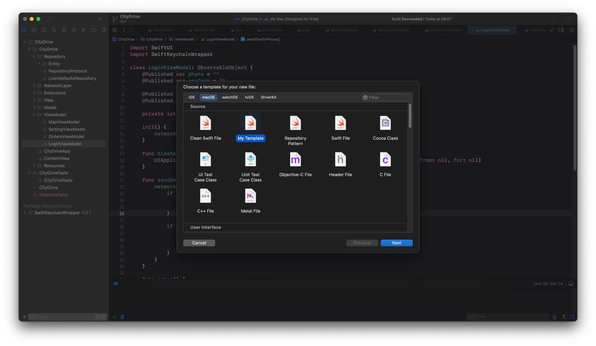
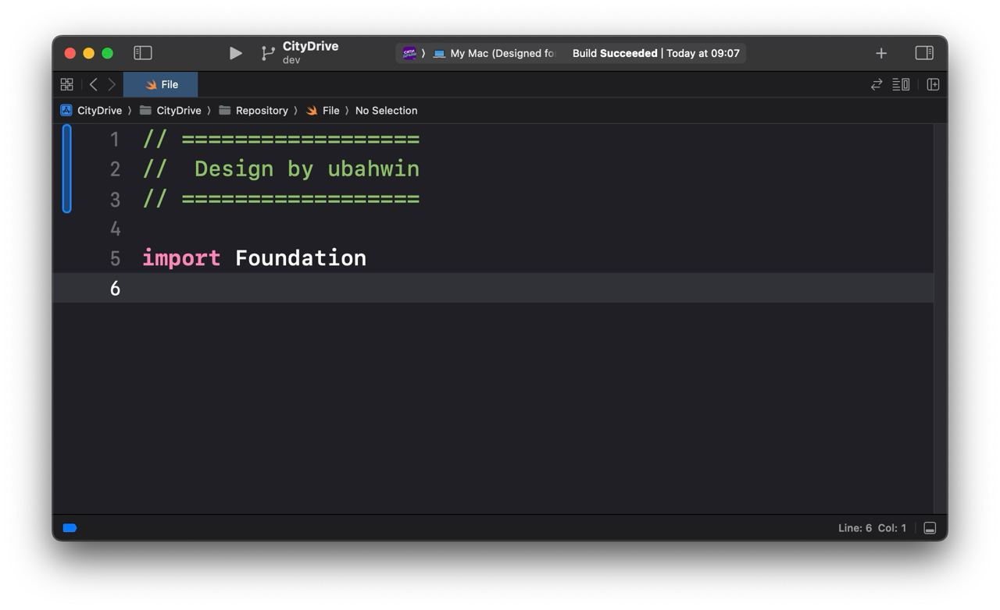
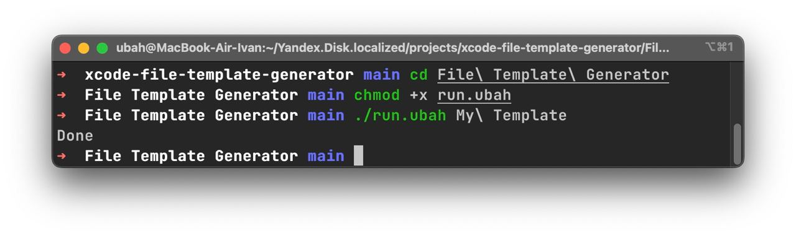

# File Template Generator

## How it works

You can create your own file template

<div align="center">
    
    
</div>

## Install

* Go to `cd xcode-file-template-generator`
* Run `chmod +x run.sh`
* Change `template-text.txt`
> Example: 
> ```swift
>// ==================
>//  Design by ubahwin
>// ==================
>
>import Foundation
>
>```

* Run `./run.sh <template name>`
* Done!

<div align="center">
    
</div>
